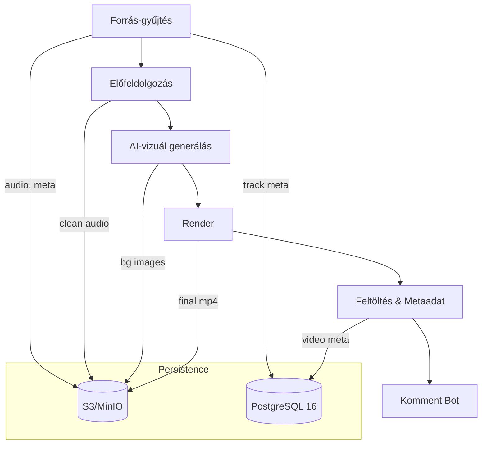

# ACCS – Automatizált Tartalomgyártó Platform

## 1. Küldetés és üzleti motiváció

Az **ACCS** (Automated Content Creation System) célja teljesen automatizált, skálázható tartalomgyártó ökoszisztéma létrehozása, amely:

* képes **copyright‑free zenés vizualizációs videókat** előállítani és publikálni YouTube‑ra és más short/long‑form platformokra;
* rövid távon **bevételt termel** a videók hirdetési és platform­‑megjelenítési bevételeiből;
* közép‑ és hosszú távon **SaaS‑ként** vagy **licencelhető szoftverként** értékesíthető, moduláris architektúrával, többféle tartalomtípus támogatásával.

## 2. Magas szintű folyamat

## 3. Fő modulok és felelősségek

| Modul          | Feladat                                      | Fő könyvtár / eszköz                               |
| -------------- | -------------------------------------------- | -------------------------------------------------- |
| **ingest**     | SoundCloud scraping, track‑meta normalizálás | Playwright, BeautifulSoup, FastAPI webhook         |
| **preprocess** | Normalizálás (LUFS), csend vágás, fade       | `ffmpeg-normalize`, `pydub`                        |
| **visual**     | Kontextus‑vezérelt háttérkép generálás       | *diffusers* + SDXL, DALL·E 3                       |
| **render**     | Audio–vizualizáció + overlay                 | FFmpeg `showspectrum`, Vizzy.io driver             |
| **upload**     | YouTube API v3, title/description/tags       | `google-api-python-client`, OpenAI Chat Completion |
| **comments**   | Automata reply, sentiment watch              | Celery task + OpenAI                               |

## 4. Architektúra elvek

* **Event‑driven microservices**: minden modul önálló Docker‑konténer, stateless; állapot S3/MinIO‑ban.
* **Task queue orchestration**: Celery 6 + RabbitMQ *Quorum Queues* biztosít retry, back‑pressure és idempotencia kezelést.
* **Infrastructure‑as‑Code**: fejlesztéskor `docker-compose`, élesben Helm chart K3s/EKS‑re.
* **CI/CD**: GitHub Actions → Docker Registry + automated Helm release.

## 5. Technológiai stack (MVP‑hez)

| Réteg       | Technológia                                    | Miért?                                               |
| ----------- | ---------------------------------------------- | ---------------------------------------------------- |
| API         | **FastAPI 0.114 + Pydantic v2**                | Aszinkron, schema‑first, gyors fejlesztés            |
| Broker      | **RabbitMQ 3.13**                              | Stabil, delayed message és Quorum Queue támogatás    |
| Workers     | **Celery 6 (2025)**                            | Érett, Python‑natív, jó ökoszisztéma                 |
| DB          | **PostgreSQL 16**                              | ACID, JSONB, full‑text search a track/meta adatokhoz |
| Objektumtár | **MinIO** (S3 kompat.)                         | Self‑host, könnyű átállni AWS S3‑ra                  |
| Audio/Video | `ffmpeg`, **MoviePy**                          | GPU‑t nem igényel a simple spectrum vizualizáció     |
| AI modellek | SDXL / OpenAI GPT‑4o                           | Kép+szöveg generálás, prompt‑alapú testreszabás      |
| Dev‑ops     | GitHub Actions, K3s, Prometheus, Grafana, Loki | Self‑contained monitoring stack                      |

## 6. Fejlesztési ütemezés (6 hetes MVP)

| Hét | Cél                    | Mérföldkő                                                     |
| --- | ---------------------- | ------------------------------------------------------------- |
| 1   | **Alap infra**         | docker-compose (Postgres, RabbitMQ, MinIO) + projekt skeleton |
| 2   | **API & queue**        | FastAPI `/jobs` → Celery chain (`ingest→render→upload`)       |
| 3   | **Audio kezelés**      | Kézi URL input, normalize + silence cut                       |
| 4   | **Vizualizáció**       | FFmpeg spectrum + generált háttér overlay                     |
| 5   | **YouTube feltöltés**  | Videó meta generálás AI‑val, publikus videó                   |
| 6   | **SoundCloud scraper** | Automata track input és sorba állítás                         |

## 7. Skálázási stratégia

1. **Stateless service scale‑out**: worker konténereket → replica‑szám növelés, külön GPU‑podos pool a kép‑generálásra.
2. **Elválasztott queue‑k**: *high‑cpu*, *gpu‑render*, *io‑upload* routing‑key‑ekkel.
3. **Autoscaling**: KEDA + Prometheus‑metrics‑alapú HPA.

## 8. Jövőbeli bővítések

* **Upscale & RIFE** – Topaz CLI integráció 4K / 60 fps‑hez.
* **Többplatformos deploy** – TikTok, Instagram Graph API.
* **Motivációs videó modul** – saját prompt‑preset, stock‑videó ingest.
* **Workflow‑engine váltás** – Temporal.io, ha komplex branching és SLA szükséges.
* **Marketplace / Plugin‑SDK** – 3rd‑party render‑ vagy ingest‑plugin monetizáció.

## 9. Licencelés és üzleti modell

* **Core AGPL‑v3** – kényszeríti a SaaS‑felhasználókat a forrás megosztására, de véd a zártkódú fork‑tól.
* **Dual‑licenc** – kereskedelmi, zártkódú használathoz fizetős licenc.
* **SaaS** – ACCS felhős instanciák per‑video vagy előfizetéses díjjal.

## 10. Nem funkcionális követelmények

* **Biztonság** – Secrets Vault (Doppler/Hashicorp), OAuth 2.0 a YouTube‑feltöltéshez.
* **Megfigyelhetőség** – minden task `trace_id`, OpenTelemetry export.
* **Tesztelhetőség** – Pytest + Playwright e2e video snapshot.

---

### Rövid fogalomjegyzék

* **ACCS** – Automated Content Creation System.
* **MVP** – Minimum Viable Product.
* **Celery chain** – Sorrendben végzett aszinkron feladatok.
* **Task queue** – Broker (RabbitMQ) + Worker rendszer.
* **SDXL** – Stable Diffusion XL, generatív képi modell.
